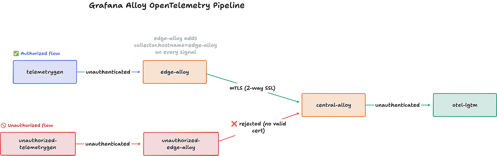

# Alloy: mTLS between an edge and central Alloy

Shows how to configure a central Alloy OTLP receiver to require mutual TLS authentication, accepting telemetry only from edge clients that present a certificate issued by a trusted CA.

## Architecture

This example sends generated OpenTelemetry telemetry through two Grafana Alloy instances:



where:

- `telemetrygen -> edge-alloy` is unauthenticated
- `edge-alloy -> central-alloy` is secured with 2-way SSL (mTLS)
- `central-alloy -> otel-lgtm` is unauthenticated (but would be authenticated if shipping to a SaaS OTLP gateway, like Grafana Cloud)

Before forwarding, `edge-alloy` upserts `collector.hostname=edge-alloy` on every signal so received telemetry can be attributed to that collector.

## Set up

First generate the certificates:

```bash
./scripts/generate-certs.sh
```

From this directory, start the stack:

```bash
docker compose up
```

Open Grafana at http://localhost:3000 and use the Drilldown apps to view the `telemetrygen` service's traces, metrics, and logs.

The Alloy UIs are available at http://localhost:12345 (edge) and http://localhost:12346 (central).

`unauthorized-edge-alloy` is also available at http://localhost:12347. It
presents a client certificate issued by a different CA, so central Alloy rejects
the connection. Its `unauthorized-telemetrygen` traces must not reach otel-lgtm.

To watch the authenticated hop, run:

```bash
docker compose logs -f edge-alloy central-alloy
```

To observe rejected mTLS connections, run:

```bash
docker compose logs -f unauthorized-edge-alloy central-alloy
```

## Tear down

Stop the stack:

```shell
docker compose down
```

## What provides mTLS

`alloy/edge.alloy` configures an OTLP exporter with the CA, client certificate, and client key. 

`alloy/central.alloy` configures its OTLP receiver with the server certificate and `client_ca_file`. This setting makes Alloy **require and verify a client certificate**. 

The central Alloy then forwards telemetry to otel-lgtm over the internal Compose network.
