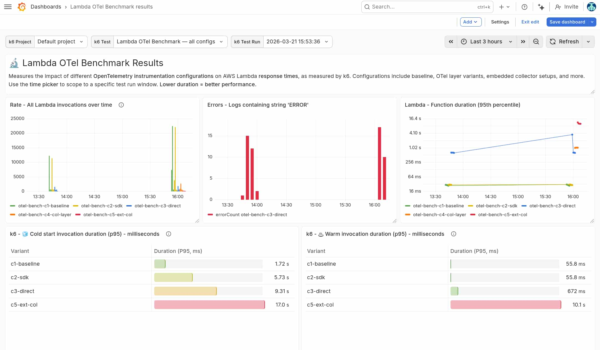

# AWS Lambda OTel Observability Benchmark

Benchmarking the latency cost of adding OpenTelemetry instrumentation to a Java Lambda function in 11 different permutations, shipping to Grafana Cloud.

Includes a nice Grafana dashboard:



## What it measures

A mock JWT-validation function (~25 ms of real work) is deployed in 11 variants that vary in instrumentation depth, exporter destination, memory allocated, and whether SnapStart is enabled or not. 

A separate k6 load test is used to test each variant, to capture cold-start and warm p50/p99 latencies.

| #  | Config            | Export target          | OTel Instrumentation | SnapStart | Memory  |
|----|-------------------|------------------------|----------------------|-----------|---------|
| 1  | `c1-baseline`     | None                   | None                 | Off       | 512 MB  |
| 2  | `c2-sdk`          | None                   | Full (no export)     | Off       | 512 MB  |
| 3  | `c3-direct`       | Grafana Cloud direct   | Full                 | Off       | 512 MB  |
| 4  | `c4-col-layer`    | Collector Lambda Layer | Full                 | Off       | 512 MB  |
| 5  | `c5-ext-col`      | External ECS Collector | Full                 | Off       | 512 MB  |
| 6  | `c6-metrics`      | Collector Lambda Layer | Metrics only         | Off       | 512 MB  |
| 7  | `c7-traces`       | Collector Lambda Layer | Traces only          | Off       | 512 MB  |
| 8  | `c8-128mb`        | Collector Lambda Layer | Full                 | Off       | 128 MB  |
| 9  | `c9-1024mb`       | Collector Lambda Layer | Full                 | Off       | 1024 MB |
| 10 | `c10-snapstart`   | Collector Lambda Layer | Full                 | On        | 512 MB  |
| 11 | `c11-direct-snap` | Grafana Cloud direct   | Full                 | On        | 512 MB  |

## Prerequisites

- AWS CLI configured with credentials for your target account
- Terraform >= 1.5
- Java 21 + Maven 3.9
- k6
- Grafana instance (open source, Enterprise or Grafana Cloud are all OK)

## Deploy the function variants

### 1. Build the Lambda function JAR

You'll need to build the function JAR locally, first.

INFO: Maven Wrapper was added to this project using `mvn wrapper:wrapper`.

```bash
cd function
./mvnw package -q
```

It may produce a warning like _"a terminally deprecated method has been called"_, but you can safely ignore that.

### 2. Configure Terraform

```bash
cd terraform
cp terraform.tfvars.example terraform.tfvars
# Edit terraform.tfvars with your Grafana Cloud credentials and layer ARNs
```

### 3. Authenticate to AWS and apply

```bash
aws sso login --sso-session SESSION

export AWS_PROFILE=...
```

```bash
terraform -chdir=terraform init
terraform -chdir=terraform apply
```

Terraform also rebuilds the JAR automatically when source files change (via `null_resource`).

## Test the function variants

### Run load tests with Grafana Cloud k6

You can run this test entirely within the included k6 usage in Grafana Cloud's free tier. k6 usage is measured in VUh (virtual user-hours), and these tests fall well within those limits.

The test will run entirely in Grafana Cloud infrastructure and store the results in your Grafana Cloud account for easy dashboard and comparison against AWS's server-side metrics.

First head to your Grafana Cloud instance > Testing and synthetics > Performance > Settings and grab your **Personal API token**:

```bash
k6 cloud login -t TOKEN --stack SLUG
```

Run the benchmark test inside Grafana Cloud k6:

```bash
k6 cloud run \
  --env C1_BASELINE_URL=$(terraform -chdir=terraform output -raw config_1_url) \
  --env C2_SDK_URL=$(terraform -chdir=terraform output -raw config_2_url) \
  --env C3_DIRECT_URL=$(terraform -chdir=terraform output -raw config_3_url) \
  --env C4_COL_LAYER_URL=$(terraform -chdir=terraform output -raw config_4_url) \
  --env C5_EXT_COL_URL=$(terraform -chdir=terraform output -raw config_5_url) \
  k6/benchmark-with-scenarios.js
```

Or, if you'd rather run it locally, but publish the results to your Grafana Cloud k6 project:

```bash
k6 cloud run --local-execution \
  --env C1_BASELINE_URL=$(terraform -chdir=terraform output -raw config_1_url) \
  --env C2_SDK_URL=$(terraform -chdir=terraform output -raw config_2_url) \
  --env C3_DIRECT_URL=$(terraform -chdir=terraform output -raw config_3_url) \
  --env C4_COL_LAYER_URL=$(terraform -chdir=terraform output -raw config_4_url) \
  --env C5_EXT_COL_URL=$(terraform -chdir=terraform output -raw config_5_url) \
  k6/benchmark-with-scenarios.js
```

### Run all load tests

Run k6 to test each config in turn:

```shell
./k6/run-all.sh
```

### Run a single load test

Test config 1 (the baseline):

```bash
FUNCTION_URL=$(terraform -chdir=terraform output -raw config_1_url) \
CONFIG_NAME=c1-baseline \
k6 run k6/benchmark.js
```

Test config 2:

```bash
FUNCTION_URL=$(terraform -chdir=terraform output -raw config_2_url) \
CONFIG_NAME=c2-sdk \
k6 run k6/benchmark.js
```

Test config 3:

```shell
FUNCTION_URL=$(terraform -chdir=terraform output -raw config_3_url) \
CONFIG_NAME=c3-direct \
k6 run k6/benchmark.js
```

Each run produces CSV output in `k6/results/`.

### Test a function manually

```sh
aws lambda invoke --region us-east-1 --function-name otel-bench-c1-baseline --payload '{}' /tmp/lambda-response.json 2>&1 && cat /tmp/lambda-response.json
```

## Observe the results in Grafana

All functions have CloudWatch Lambda Insights enabled. Metrics are available in CloudWatch under the `LambdaInsights` namespace, so we'll set up the CloudWatch data source in Grafana.

### Set up AWS CloudWatch data source and install dashboard

Get the generated access key and secret:

```shell
terraform -chdir=terraform output grafana_cloudwatch_access_key_id

terraform -chdir=terraform output -raw grafana_cloudwatch_secret
```

In Grafana:

1. Go to **Connections → Data sources → Add data source → CloudWatch**.
2. Set **Authentication provider** to `Access & secret key`.
3. Paste the **Access key ID** and **Secret access key** from the Terraform outputs above.
4. Set **Default region** to `us-east-1`.
5. Click **Save & test** — you should see "Data source is working".

Install the sample dashboard:

```shell
grafanactl config use-context YOUR_CONTEXT  # for example "dev"

grafanactl resources push -p ./resources/
```

### Access the dashboard

Open the dashboard, then, in the variable dropdowns, select your k6 Project, test and test run, to see correlated client-side request metrics for each variant, from the k6 test you ran above.

## Architecture

### Lambda Layer collector

Config 4, 6, 7, 8, 9, 10 use the OTel Collector running as a Lambda Extension (via the ADOT collector layer). The function sends OTLP HTTP to `localhost:4318`; the extension forwards to Grafana Cloud.

### External ECS collector

Config 5 deploys a standalone `otel/opentelemetry-collector-contrib` container on ECS Fargate behind a Network Load Balancer. The Lambda sends OTLP HTTP to the NLB's public DNS. This models the pattern where customers run their own internal collectors before pushing to an external observability platform (Grafana Cloud!).

## Status

Check what's actually deployed:

```bash
aws sso login --sso-session SESSION

export AWS_PROFILE=...
```

```bash
terraform -chdir=terraform state list
```

## Teardown

Delete the Lambda infrastructure:

```bash
terraform -chdir=terraform destroy 
```

## Architectural decisions

- **k6 tests are organised into scenarios:** so we can view all the results using a single query on a dashboard
- **each k6 scenario runs in sequence:** so that we avoid any doubt around resource contention between Lambda functions (there shouldn't be any, but this just makes sure of it)

