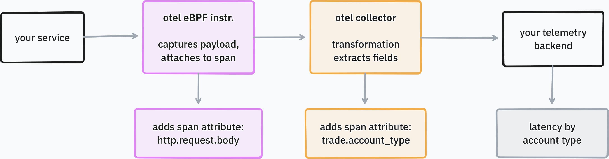
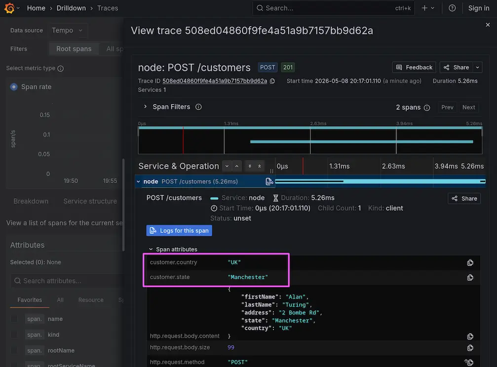

# Beyla: HTTP body attribute extraction

Shows how to use Beyla and Alloy to extract attributes from HTTP bodies, using payload extraction and enrichment, and OTTL.

- Simulates a stock trading API where the server's per-trade latency varies by `accountType` (`retail` is slow, `pro` is medium, `highfreq` is fast)
- Uses payload extraction in Beyla/OBI to get the request JSON payload for a service
- Uses OTTL in Alloy to parse the JSON body, storing `trade.account_type`, `trade.symbol`, and `trade.side` as span attributes
- Lets you break down `POST /orders` latency by `trade.account_type` in Grafana to find out which account types are slow, and which are fast!



## Getting started

Run the following command to start the services:

```shell
docker compose up
```

Or if you're using podman, run as root, since we need a privileged container for Beyla:

```shell
sudo podman-compose up -d --build
```

Wait 30 seconds for the services to start and begin shipping traces.

Then visit Traces Drilldown and find a `POST /orders` trace to see that the attributes were extracted. Group or filter by `trade.account_type` to see the per-tier latency split:



Grab the Beyla logs if you need them for debugging:

```shell
sudo podman-compose logs beyla | tee beyla.log
```

## Tear down

To tear down:

```shell
sudo podman-compose down
```
