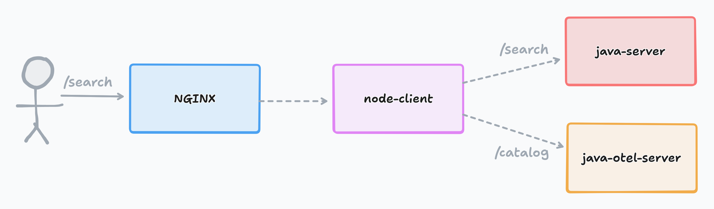
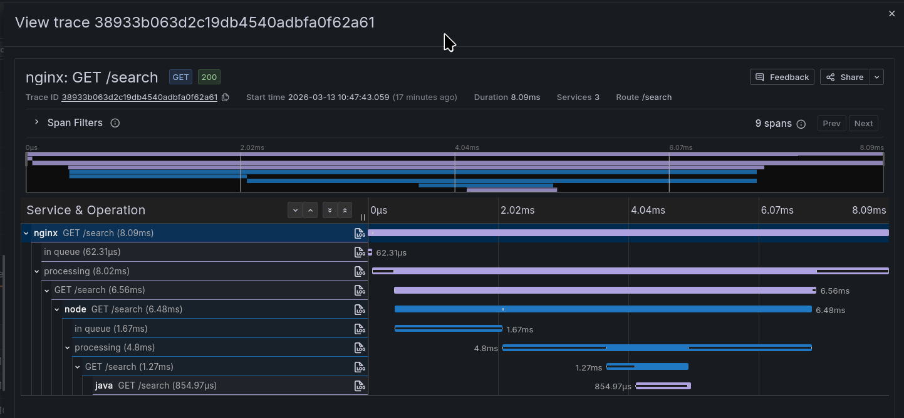

# Beyla: Context propagation demo

Demonstration of propagation of trace context between services with Beyla (OBI) in containers.

Beyla instruments two containers and injects W3C TraceContext headers into the outgoing call from the included Node.js and Java applications, allowing traces from both applications to be correlated in Tempo.



## Getting started

Run the following command to start the services:

```shell
docker compose up
```

Or if you're using podman - don't forget to run as root since we need a privileged container for Beyla:

```shell
sudo podman-compose up -d --build
```

Check all the containers are running:

```shell
sudo podman ps
```

Then, to tear down:

```shell
sudo podman-compose down
```

### Send test requests

Send a request to NGINX:

```shell
curl localhost:18080/search
```

### Find the trace

Wait a few seconds for the trace to be flushed and exported.

Then, open Grafana at http://localhost:3000. Navigate to Drilldown -> Traces and look for **nginx** service traces. You should find a trace like this:



## Troubleshooting

Traces are missing:

- Wait a few seconds for traces to be exported
- Ensure you're running the containers as root, since Beyla requires privileged containers to be able to attach to processes
