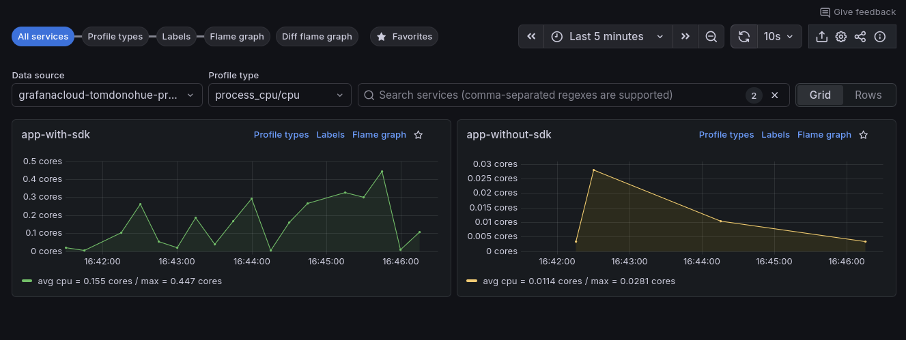

# .NET Kubernetes Pyroscope SDK Demo

Continuous profiling of a .NET application using the Pyroscope .NET native profiler.

This demo compares two different approaches:

- **Using the SDK:** 
  - Add the Pyroscope SDK to your application
  - Optionally, define labels - but this is not necessary
  - Configure the destination to send profiles to, with environment variables
- **Using eBPF (via the Kubernetes Monitoring Helm chart):** 
  - Enable `profiles.enabled` in the Kubernetes Monitoring Helm chart
  - Set this annotation on the Pods to be profiled: `profiles.grafana.com/cpu.ebpf.enabled: "true"`.
  - The container name (in the Kubernetes manifest) will be used as the **service name** in Pyroscope.



_Continuous profiles collection, two ways_

## Overview

This demo shows how to:
- Instrument a .NET 8 Web API application with the Pyroscope native profiler
- Collect CPU profiles automatically without code changes
- Generate CPU load with various computational endpoints
- Visualize profiles in Grafana

Two deployment options:
- **Docker Compose** (recommended for local testing) - Uses `grafana/otel-lgtm` stack
- **Kubernetes** - Deploy to k3s or any Kubernetes cluster with Grafana Cloud

## Prerequisites

### For Docker Compose (Simpler)

- [Docker](https://www.docker.com/) or [Podman](https://podman.io/) with Compose support

### For Kubernetes

- [k3s](https://k3s.io/) - Lightweight Kubernetes
- [kubectl](https://kubernetes.io/docs/tasks/tools/) - Kubernetes CLI
- [Docker](https://www.docker.com/) or [Podman](https://podman.io/) - Container runtime
- A Grafana Cloud account (free tier works) with Pyroscope enabled

## How It Works

### Pyroscope Native Profiler

The Pyroscope .NET profiler uses a **CLR profiler** that operates at the runtime level:

1. **Native libraries** (`Pyroscope.Profiler.Native.so` and `Pyroscope.Linux.ApiWrapper.x64.so`) are copied from the official Docker image
2. The profiler is **injected into the .NET runtime** via environment variables (`CORECLR_PROFILER`)
3. CPU profiles are **automatically collected** without code changes
4. Profiles are **pushed directly** to Grafana Cloud Pyroscope
5. The `Pyroscope` NuGet package provides a **managed API** that can be used to add custom labels

### Labeling Strategy

The demo showcases two types of labels:

**Static labels** (set via `PYROSCOPE_LABELS` env var):
- `env:demo`
- `cluster:k3s-local`

**Dynamic labels** (set in code using `Pyroscope.LabelsWrapper`):
- `endpoint` - Which API endpoint was called
- `complexity` / `range_size` / `matrix_size` / `iterations` - Request characteristics

## Quick Start with Docker Compose

The fastest way to try the demo locally:

```bash
cd dotnet-k8s-pyroscope-sdk

# Start the stack (includes Grafana + Pyroscope + .NET app)
docker compose up -d

# Or with Podman
podman-compose up -d
```

Access the services:
- **Application**: http://localhost:8080
- **Grafana**: http://localhost:3000 (no login required)

Test the endpoints:

```bash
# View available endpoints
curl http://localhost:8080/

# Generate some CPU load
curl http://localhost:8080/fibonacci/35
curl http://localhost:8080/prime/50000
curl http://localhost:8080/matrix/200
curl http://localhost:8080/hash/10000
```

View profiles in Grafana:

1. Open http://localhost:3000
2. Navigate to **Drilldown** -> **Profiles** (compass icon)
3. View flame graphs for the app-with-sdk application

Generate continuous load:

```bash
while true; do
  curl -s http://localhost:8080/fibonacci/$(( 30 + RANDOM % 10 )) > /dev/null
  sleep 1
  curl -s http://localhost:8080/prime/$(( 20000 + RANDOM % 80000 )) > /dev/null
  sleep 1
  curl -s http://localhost:8080/matrix/$(( 100 + RANDOM % 200 )) > /dev/null
  sleep 1
done
```

Stop the stack:

```bash
docker compose down

# Or with Podman
podman-compose down
```

## Kubernetes Setup (Advanced)

For deploying to Kubernetes with Grafana Cloud:

### 1. Install k3s

Install k3s on your local machine:

```bash
curl -sfL https://get.k3s.io | sh -
```

Set up kubectl access:

```bash
mkdir -p ~/.kube
sudo cp /etc/rancher/k3s/k3s.yaml ~/.kube/config
sudo chown $USER ~/.kube/config
export KUBECONFIG=~/.kube/config
```

Verify k3s is running:

```bash
kubectl get nodes
```

### 2. Install Kubernetes Monitoring Helm chart

You need a Grafana Cloud account with Pyroscope enabled.

1. Log in to [Grafana Cloud](https://grafana.com)
2. Navigate to **Kubernetes** → **Configuration**
3. Enter the details provided
4. Ensure Profiles option is checked.
5. Copy the generated shell command to install the k8s-monitoring Helm chart.

### 3. Configure the Deployment

Create a `.env` file in the `k8s/` directory with your Grafana Cloud credentials:

```bash
cd k8s
cat > .env << EOF
PYROSCOPE_SERVER_ADDRESS=https://profiles-prod-XXX.grafana.net
PYROSCOPE_BASIC_AUTH_USER=123456
PYROSCOPE_BASIC_AUTH_PASSWORD=glc_xxxxxxxxxxxxxxxxxxxxxxxxxxxxx
EOF
```

Create a Kubernetes Secret from the `.env` file:

```bash
kubectl create secret generic pyroscope-config --from-env-file=k8s/.env
```

The deployment references this Secret for credentials while keeping app name and labels as plain values.

### 4. Build and Deploy the .NET Applications

This demo includes two deployments to compare SDK-based vs eBPF-based profiling:

#### Option A: app-with-sdk (SDK-based profiling)

Build the Docker image with Pyroscope SDK:

```bash
docker build -t dotnet-pyroscope-app-with-sdk:latest ./app-with-sdk
```

Import into k3s:

```bash
docker save dotnet-pyroscope-app-with-sdk:latest | sudo k3s ctr images import -
```

Deploy to Kubernetes:

```bash
kubectl apply -f k8s/app-with-sdk-deploy.yaml
kubectl apply -f k8s/app-with-sdk-service.yaml
```

Verify the deployment:

```bash
kubectl get pods -l app=app-with-sdk
kubectl logs -l app=app-with-sdk
```

Look for log messages indicating the Pyroscope profiler loaded successfully.

#### Option B: app-uninstrumented (eBPF-based profiling)

> [!IMPORTANT]
> Ensure you have installed the Kubernetes Monitoring Helm chart in your cluster for this to work.

Build the Docker image without Pyroscope SDK (regular .NET app):

```bash
docker build -t dotnet-pyroscope-app-uninstrumented:latest ./app-uninstrumented
```

Import into k3s:

```bash
docker save dotnet-pyroscope-app-uninstrumented:latest | sudo k3s ctr images import -
```

Deploy to Kubernetes:

```bash
kubectl apply -f k8s/app-uninstrumented-deploy.yaml
kubectl apply -f k8s/app-uninstrumented-service.yaml
```

Verify the deployment:

```bash
kubectl get pods -l app=app-uninstrumented
kubectl logs -l app=app-uninstrumented
```

This deployment uses the annotation `profiles.grafana.com/cpu.ebpf.enabled: "true"` to enable eBPF-based profiling. The container name (`app-without-sdk`) will be used as the service name in Pyroscope.

#### Deploy Both for Comparison

To compare both approaches side-by-side:

```bash
# Build both images
docker build -t dotnet-pyroscope-app-with-sdk:latest ./app-with-sdk
docker build -t dotnet-pyroscope-app-uninstrumented:latest ./app-uninstrumented

# Import both into k3s
docker save dotnet-pyroscope-app-with-sdk:latest | sudo k3s ctr images import -
docker save dotnet-pyroscope-app-uninstrumented:latest | sudo k3s ctr images import -
```

Now deploy both applications and then verify:

```bash
kubectl apply -f k8s/app-with-sdk-deploy.yaml
kubectl apply -f k8s/app-with-sdk-service.yaml
kubectl apply -f k8s/app-uninstrumented-deploy.yaml
kubectl apply -f k8s/app-uninstrumented-service.yaml

# Verify both deployments
kubectl get pods
```

### 5. Deploy the Load Generator (Optional)

Deploy a CronJob to automatically generate traffic:

```bash
kubectl apply -f k8s/load-generator.yaml
```

This hits various endpoints every 2 minutes to generate diverse CPU profiles.

## Testing

### Access the Applications

Get the node IP:

```bash
NODE_IP=$(kubectl get nodes -o jsonpath='{.items[0].status.addresses[?(@.type=="InternalIP")].address}')
echo "app-with-sdk available at: http://${NODE_IP}:30080"
echo "app-uninstrumented available at: http://${NODE_IP}:30081"
```

Test the app-with-sdk endpoints:

```bash
curl http://${NODE_IP}:30080/
curl http://${NODE_IP}:30080/health
curl http://${NODE_IP}:30080/fibonacci/35
curl http://${NODE_IP}:30080/prime/50000
curl http://${NODE_IP}:30080/matrix/200
curl http://${NODE_IP}:30080/hash/10000
```

Test the app-uninstrumented endpoints:

```bash
curl http://${NODE_IP}:30081/
curl http://${NODE_IP}:30081/health
curl http://${NODE_IP}:30081/fibonacci/35
curl http://${NODE_IP}:30081/prime/50000
curl http://${NODE_IP}:30081/matrix/200
curl http://${NODE_IP}:30081/hash/10000
```

### Port Forward (Alternative)

Port-forward to access locally:

```bash
# app-with-sdk
kubectl port-forward svc/app-with-sdk 8086:8080

# app-uninstrumented (in a separate terminal)
kubectl port-forward svc/app-uninstrumented 8087:8080
```

Then test:

```bash
# Test app-with-sdk
curl http://localhost:8086/fibonacci/38
curl http://localhost:8086/prime/100000

# Test app-uninstrumented
curl http://localhost:8087/fibonacci/38
curl http://localhost:8087/prime/100000
```

### Generate Continuous Load

Create interesting profiles with randomized requests:

```bash
while true; do
  curl -s http://localhost:8086/fibonacci/$(( 30 + RANDOM % 10 )) > /dev/null
  sleep 1
  curl -s http://localhost:8086/prime/$(( 20000 + RANDOM % 80000 )) > /dev/null
  sleep 1
  curl -s http://localhost:8086/matrix/$(( 100 + RANDOM % 200 )) > /dev/null
  sleep 1
  curl -s http://localhost:8086/hash/$(( 5000 + RANDOM % 45000 )) > /dev/null
  sleep 2
done
```

## Viewing Profiles in Grafana

### 1. Access Grafana Cloud

1. Log in to your Grafana Cloud instance
2. Navigate to **Explore** (compass icon in left sidebar)
3. Select **Profiles** as the data source

### 2. Query Profiles

Select the service names to compare:
- **app-with-sdk** - SDK-based profiling with Pyroscope libraries
- **app-without-sdk** - eBPF-based profiling (the container name from app-uninstrumented deployment)

You should see profiles appearing within 10-15 seconds.

### 3. Filter by Labels

Try these Pyroscope queries:

```
# SDK-based profiling
{service_name="app-with-sdk"}

# eBPF-based profiling (uses container name)
{service_name="app-without-sdk"}
```

### 4. Analyze Flame Graphs

- **Flame Graph**: Shows the call stack and where CPU time is spent
- **Top Table**: Lists functions by CPU consumption
- **Sandwich View**: Shows callers and callees of a selected function
- **Timeline**: Track CPU usage patterns over time

### What to Look For

Each endpoint produces distinct flame graph patterns:

- **Fibonacci**: Deep recursive call stacks
- **Prime**: Iterative loops with prime checking functions
- **Matrix**: Nested loops for matrix operations
- **Hash**: SHA256 computation with cryptographic functions

## Endpoints

The application exposes these CPU-intensive endpoints:

- `GET /` - API information
- `GET /health` - Health check
- `GET /fibonacci/{n}` - Recursive Fibonacci (n: 0-45)
  - Labels: `endpoint=fibonacci`, `complexity=high|low`
- `GET /prime/{n}` - Prime number finding (n: 2-1000000)
  - Labels: `endpoint=prime`, `range_size=large|small`
- `GET /matrix/{size}` - Matrix multiplication (size: 2-500)
  - Labels: `endpoint=matrix`, `matrix_size=large|small`
- `GET /hash/{iterations}` - SHA256 hashing (iterations: 1-1000000)
  - Labels: `endpoint=hash`, `iterations=high|low`

## Troubleshooting

### In Kubernetes

**Profiler not loading:**

Check container logs for profiler initialization:

```bash
kubectl logs -l app=app-with-sdk | grep -i pyroscope
```

### Profiles not appearing in Grafana Cloud

1. **Verify credentials**: Check that `PYROSCOPE_SERVER_ADDRESS`, `PYROSCOPE_BASIC_AUTH_USER`, and `PYROSCOPE_BASIC_AUTH_PASSWORD` are correct

2. **Check application logs**:
   ```bash
   kubectl logs -l app=app-with-sdk
   ```

3. **Verify network connectivity**: Ensure the pods can reach Grafana Cloud:
   ```bash
   kubectl exec -it deployment/app-with-sdk -- curl -v https://profiles-prod-XXX.grafana.net
   ```

4. **Check profiler environment variables**:
   ```bash
   kubectl exec -it deployment/app-with-sdk -- env | grep PYROSCOPE
   kubectl exec -it deployment/app-with-sdk -- env | grep CORECLR
   ```

### Build failures

If the Docker build fails:

1. **Check native library paths**: Ensure the `COPY --from=pyroscope/pyroscope-dotnet` commands succeed
2. **Verify NuGet package**: The `Pyroscope` package (not `Pyroscope.Profiler.AspNetCore`) should be in the .csproj
3. **Check .NET SDK version**: Ensure .NET 8 SDK is available

### Permission errors

The profiler needs to load native libraries. If you see permission errors:

```bash
# Remove the USER directive from Dockerfile or adjust file permissions
chmod +x /dotnet/Pyroscope.Profiler.Native.so
chmod +x /dotnet/Pyroscope.Linux.ApiWrapper.x64.so
```

### Image not found in k3s

Verify the image was imported:

```bash
sudo k3s ctr images ls | grep app-with-sdk
```

If not found, re-import:

```bash
docker save dotnet-pyroscope-app-with-sdk:latest | sudo k3s ctr images import -
```

### Bad magic number

> bad magic number '[77 90 144 0]' in record at byte 0x0


## Supported Profiling Types

The Pyroscope .NET native profiler supports:

- ✅ **CPU profiling** - Default, enabled automatically
- ✅ **Wall time profiling** - Set `PYROSCOPE_PROFILING_WALLTIME_ENABLED=1`
- ✅ **Allocation profiling** - Set `PYROSCOPE_PROFILING_ALLOCATION_ENABLED=1`
- ✅ **Lock contention** - Set `PYROSCOPE_PROFILING_LOCK_ENABLED=1`
- ✅ **Exception profiling** - Set `PYROSCOPE_PROFILING_EXCEPTION_ENABLED=1`
- ✅ **Live heap** (.NET 7+) - Set `PYROSCOPE_PROFILING_HEAP_ENABLED=1`

To enable additional profiling types, add environment variables to `k8s/deployment.yaml`.

## Cleanup

### Docker Compose

```bash
docker compose down -v

# Or with Podman
podman-compose down -v
```

### Kubernetes

Remove the application:

```bash
kubectl delete -f k8s/
```

Uninstall k3s:

```bash
/usr/local/bin/k3s-uninstall.sh
```

## Additional Resources

- [Pyroscope .NET Documentation](https://grafana.com/docs/pyroscope/latest/configure-client/language-sdks/dotnet/)
- [Pyroscope .NET GitHub Repository](https://github.com/grafana/pyroscope-dotnet)
- [Grafana Cloud Profiles](https://grafana.com/products/cloud/profiles-for-continuous-profiling/)
- [k3s Documentation](https://docs.k3s.io/)
- [.NET CLR Profiler](https://learn.microsoft.com/en-us/dotnet/framework/unmanaged-api/profiling/)
