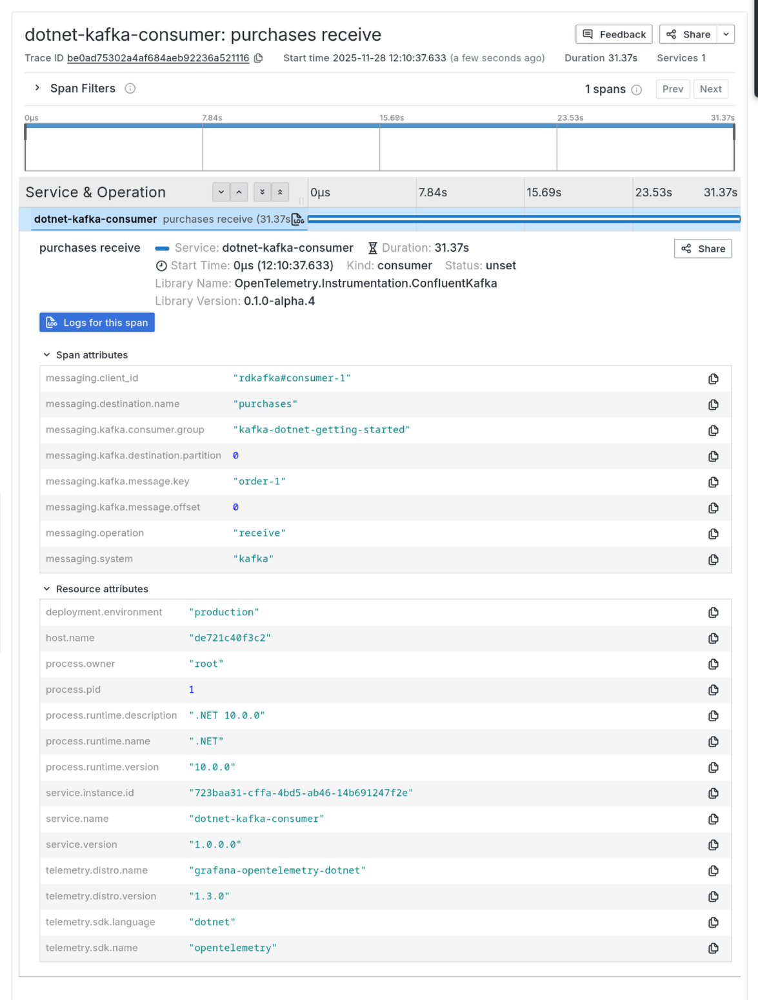

# .NET Core 10: Kafka consumer example

Example .NET Core application which consumes messages from a Kafka topic, instrumented with OpenTelemetry.

## To run/test

```sh
docker compose up
```

Then run the test script to send messages to Kafka:

```sh
./test-publish.sh
```

Go to http://localhost:3000 -> Drilldown -> Traces and you should see traces appear in Grafana Tempo:



## How it works

### Adding Grafana OpenTelemetry instrumentation

Following: https://grafana.com/docs/opentelemetry/instrument/grafana-dotnet/

1. Add OpenTelemetry packages:

    ```sh
    dotnet add package Grafana.OpenTelemetry
    
    dotnet add package OpenTelemetry.Exporter.Console
    ```

1. Add bootstrapping code to `Program.cs`.

1. Run with:

    ```sh
    OTEL_RESOURCE_ATTRIBUTES="service.name=myapp,service.namespace=apps,deployment.environment=local" \
    OTEL_EXPORTER_OTLP_ENDPOINT=http://localhost:4317 \
    OTEL_EXPORTER_OTLP_PROTOCOL="http/protobuf" \
    dotnet run
    ```

1. You should see some output in the console, like:

    ```sh
    tdonohue@harold:~/repos/grafana-playground/dotnet-kafka-otel$   OTEL_RESOURCE_ATTRIBUTES="service.name=myapp,service.namespace=apps,deployment.environment=local" \
    >   OTEL_EXPORTER_OTLP_ENDPOINT=http://localhost:4317 \
    >   OTEL_EXPORTER_OTLP_PROTOCOL="http/protobuf" \
    >   dotnet run
    Hello, World!
    Resource associated with Metrics:
    service.name: dotnet-kafka-otel
    service.version: 1.0.0.0
    service.instance.id: 0c23ab47-aff7-4b82-b8b5-62f2dc562c4c
    telemetry.distro.name: grafana-opentelemetry-dotnet
    telemetry.distro.version: 1.3.0
    deployment.environment: production
    process.runtime.description: .NET 10.0.0
    process.runtime.name: .NET
    process.runtime.version: 10.0.0
    process.owner: tdonohue
    process.pid: 4089784
    host.name: harold
    host.id: b12657d0111843379fd4c6885223255e
    service.namespace: apps
    telemetry.sdk.name: opentelemetry
    telemetry.sdk.language: dotnet
    telemetry.sdk.version: 1.14.0
    ```

### Adding Kafka instrumentation

To enhance the application to add Kafka instrumentation, we used the `Confluent.Kafka.Extensions.OpenTelemetry` package.

1.  Add the package:

    ```sh
    dotnet add package Confluent.Kafka.Extensions.OpenTelemetry
    ```

1.  Update the bootstrapping code:

    ```csharp
    using Confluent.Kafka.Extensions.Diagnostics;
    using Confluent.Kafka.Extensions.OpenTelemetry;
   
    using var tracerProvider = Sdk.CreateTracerProviderBuilder()
        .UseGrafana()
        .AddConfluentKafkaInstrumentation()
        .Build();
    ```

1.  Use `.consumeWithInstrumentation()` instead of `.consume()` in the program.

    ```csharp
    consumer.ConsumeWithInstrumentation((result) =>
    {
        if (result != null)
        {
            Console.WriteLine(result.Message.Value);
            logger.LogInformation(
                "Consumed event from topic {Topic}: key = {Key} value = {Value}",
                topic, 
                result.Message.Key, 
                result.Message.Value
            );
        }   
    }, 2000);
    ```
