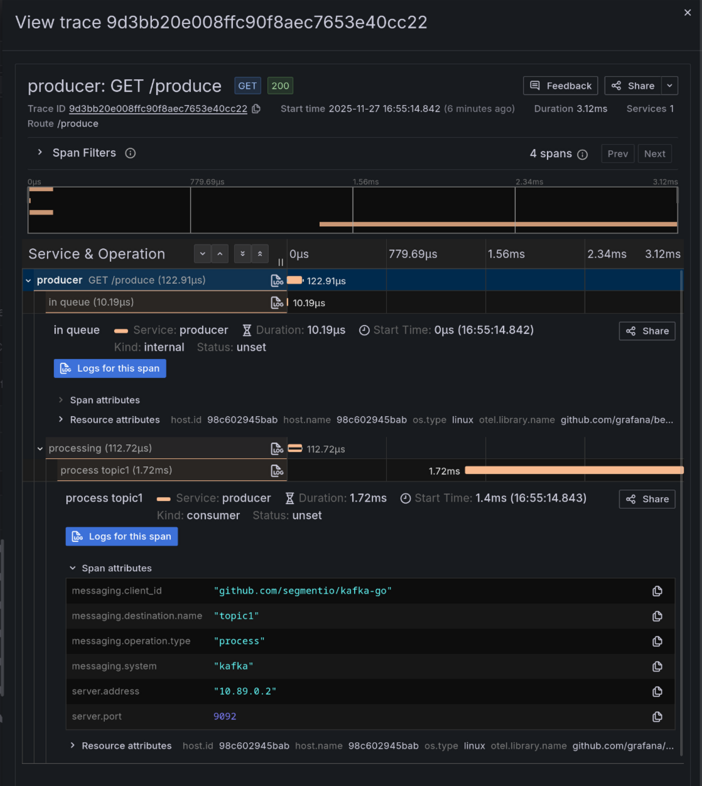

# Kafka Client OpenTelemetry Traces with Beyla

This example demonstrates generating a distributed trace that spans HTTP requests and Kafka messaging, using the segmentio/kafka-go library. The setup consists of:

-   **`kafkaproducer`**: An HTTP server that produces a batch of two messages to different Kafka topics.
-   **`kafkaconsumer`**: A consumer that processes these messages and generates a manual span for each one. This manual span appears as a child of the consumer span.

**Acknowledgement:** This example is derived from the [OpenTelemetry Go Instrumentation Kafka example](https://github.com/open-telemetry/opentelemetry-go-instrumentation/tree/main/examples/kafka-go) but swaps out Beyla. The example app source code is Apache 2.0 licensed and (c) the respective authors.

## Usage

### 1. Start the services

Run the following command to start the services:

```sh
docker compose up
```

Or if you're using podman:

```sh
sudo podman-compose up
```

### 2. Generate traffic

After the services are up, send a request to the server:

```sh
curl localhost:8080/produce
```

This triggers the production of two messages, in a batch.

### 3. Observe traces

Every request generates a trace which ships to the included otel-lgtm backend. You can observe them in the local Grafana instance included in the Compose configuration. Like this!


