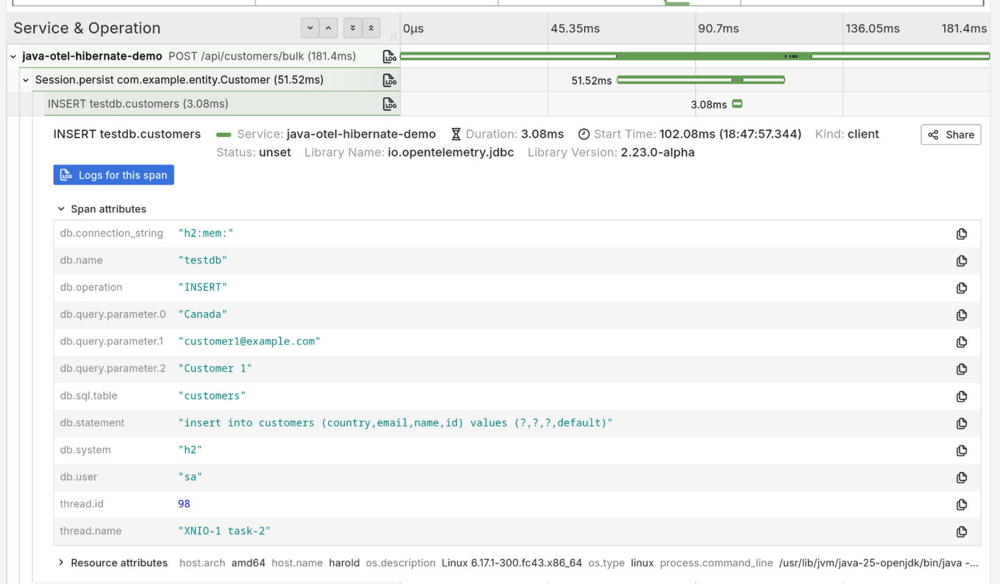

# Java (Hibernate): Capturing DB Statements as OTLP Logs and Traces with OpenTelemetry

A simple Java REST API using JAX-RS, Undertow, and Hibernate with an H2 in-memory database.

## Features

- **REST API**: JAX-RS (RESTEasy) endpoints for CRUD operations
- **Database**: H2 in-memory database with Hibernate ORM
- **Dual Content-Type Support**: Accepts both JSON and form-urlencoded data
- **Auto Schema Generation**: Hibernate creates database schema from JPA entities
- **OpenTelemetry Instrumentation**: Automatic traces, metrics, and logs export via OTLP
- **SQL Logging**: Hibernate SQL statements captured as structured logs via SLF4J/Logback
- **Bind parameter capture:** Captures database query bind params in traces, using the experimental `otel.instrumentation.jdbc.experimental.capture-query-parameters` setting

## Observability

**Logs** are captured using OpenTelemetry's auto-instrumentation for:
- **SLF4J/Logback**: Application logs and Hibernate SQL statements
- **JBoss Logging**: Hibernate internal logs

All logs are automatically correlated with traces and exported via OTLP.

## Prerequisites

- Java 17 or higher

## Building and Running

### With Maven

Build the application:

```bash
./mvnw clean package
```

### Running with OpenTelemetry Java Agent

Download the OpenTelemetry Java agent:

```bash
wget -q -O opentelemetry-javaagent.jar https://github.com/open-telemetry/opentelemetry-java-instrumentation/releases/download/v2.23.0/opentelemetry-javaagent.jar
```

Run with the agent (uses `exec:exec` to fork a new JVM and attach the OpenTelemetry Java agent):

```bash
./mvnw compile exec:exec@run-with-otel
```

The agent is pre-configured to export to OTLP at `http://localhost:4318`. You can override settings:

```bash
./mvnw compile exec:exec@run-with-otel \
  -Dotel.exporter.otlp.endpoint=http://otel.example.com:4318 \
  -Dotel.service.name=my-service
```

Or use a different agent path:

```bash
./mvnw compile exec:exec@run-with-otel -Dotel.javaagent.path=/path/to/agent.jar
```

You should see OpenTelemetry agent logs like:
```
[otel.javaagent 2024-01-01 12:00:00:000 +0000] [main] INFO io.opentelemetry.javaagent.tooling.VersionLogger - opentelemetry-javaagent - version: 2.23.0
```

To run **without** the agent, use the standard java command:

```bash
java -jar target/java-otel-hibernate-demo-1.0-SNAPSHOT.jar
```

### With Docker/Podman

Build the image:

```bash
podman build -t java-otel-demo .
```

Run the container:

```bash
podman run -p 8080:8080 java-otel-demo
```

## Testing the API

The server starts on http://localhost:8080

### Basic Endpoints

Test the hello endpoint:

```bash
curl http://localhost:8080/api/hello
```

Check the health endpoint:

```bash
curl http://localhost:8080/api/health
```

### Customer Endpoints

Create a customer with JSON:

```bash
curl -X POST http://localhost:8080/api/customers \
  -H "Content-Type: application/json" \
  -d '{"name":"John Doe","email":"john@example.com","country":"USA"}'
```

Create a customer with form data:

```bash
curl -X POST http://localhost:8080/api/customers \
  -H "Content-Type: application/x-www-form-urlencoded" \
  -d "name=Jane Doe&email=jane@example.com&country=Canada"
```

Or simply:

```bash
curl -X POST http://localhost:8080/api/customers \
  -d "name=Bob Smith&email=bob@example.com&country=UK"
```

List all customers:

```bash
curl http://localhost:8080/api/customers
```

### Bulk Customer Creation (for Testing Multiple DB Operations)

Create multiple customers in a single request to simulate multiple database interactions:

```bash
# Create 25 customers
curl -X POST http://localhost:8080/api/customers/bulk \
  -d "count=25"
```

Or with JSON:

```bash
curl -X POST http://localhost:8080/api/customers/bulk \
  -H "Content-Type: application/json" \
  -d '{"count":25}'
```

This endpoint:
- Creates N customers with auto-generated names, emails, and countries
- Flushes to the database every 10 customers (generating multiple SQL INSERT batches)
- Generates multiple log entries and database spans in a single trace
- Perfect for observing traces in your OTLP backend

## Project Structure

- `src/main/java/com/example/RestApplication.java` - Main application class that starts Undertow server
- `src/main/java/com/example/HelloResource.java` - JAX-RS resource with REST endpoints
- `src/main/java/com/example/resource/CustomerResource.java` - Customer REST API endpoints
- `src/main/java/com/example/entity/Customer.java` - JPA entity for customer data (id, name, email, country)
- `src/main/java/com/example/util/HibernateUtil.java` - Hibernate EntityManager factory utility
- `src/main/resources/META-INF/persistence.xml` - JPA/Hibernate configuration
- `src/main/resources/logback.xml` - Logback logging configuration (SQL logging)
- `pom.xml` - Maven configuration with dependencies (Hibernate, H2, RESTEasy)
- `Dockerfile` - Multi-stage build using Eclipse Temurin JDK and JRE

## What Gets Captured as OTLP Logs

When running with the OpenTelemetry agent, the following logs are automatically captured and exported:

1. **Application Logs** (via SLF4J):
   ```
   Creating customer: name=John Doe, email=john@example.com, country=USA
   Customer created successfully with id=1
   ```

2. **SQL Statements** (via Hibernate logger `org.hibernate.SQL`):
   ```
   insert into customers (country,email,name,id) values (?,?,?,default)
   select c1_0.id,c1_0.country,c1_0.email,c1_0.name from customers c1_0
   ```

3. **SQL Parameters** (via `org.hibernate.orm.jdbc.bind` at TRACE level):
   ```
   binding parameter (1:VARCHAR) <- [Japan]
   binding parameter (2:VARCHAR) <- [customer95@example.com]
   binding parameter (3:VARCHAR) <- [Customer 95]
   ```

4. **Hibernate Internal Logs** (via JBoss Logging):
   ```
   HHH000204: Processing PersistenceUnitInfo [name: customerPU]
   ```

All logs include automatic trace correlation (trace_id, span_id) when running with the OpenTelemetry agent!

**Tip**: Use the `/api/customers/bulk` endpoint to see multiple database operations in a single trace, making it easy to observe the waterfall of SQL statements, logs, and their correlation with the parent HTTP request span.

## Example screenshots


