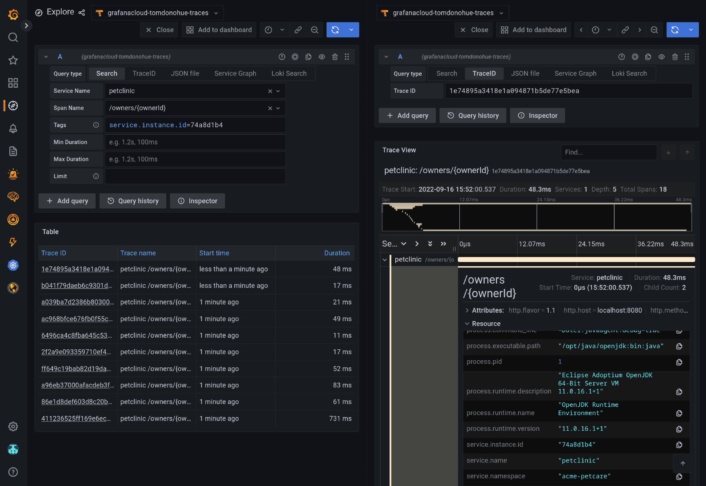

# java-spring-otel

Demo of collecting traces, logs and metrics from a Java application and sending them to Grafana Cloud.

This leverages the legendary, ubiquitous Spring Petclinic demo app!

**Instructions given for a Linux environment. Substitute equivalent Windows commands if you need to.**

## Prerequisites

- Create a Grafana Cloud account (free tier is OK!)
- Log in to your Grafana Cloud account, then in the main Portal page:
- Copy your Tempo details
  - Navigate to _Tempo_ &rarr; _Details_
  - Copy the hostname of your Tempo instance (e.g. `tempo-example-01-example-hiya.grafana.net`)
  - Copy your username (e.g. `123456`)
  - Generate a new Grafana.com API key, give it the _MetricsPublisher_ role and copy the API key string.
- Copy your Prometheus details
  - Navigate to _Prometheus_.
  - Copy the "remote push" URL (e.g. `https://prometheus-region-country-blah.grafana.net/api/prom/push`)

## Getting started

Install Docker & Docker Compose, or Podman & Podman Compose, _as is your wont_.

Set your Grafana Cloud authentication details as environment variables, so we can push traces to Tempo.

**Note that the tempo endpoint should NOT have an `https` prefix, but SHOULD have a port number, with NO trailing path.**

Set some env vars for Tempo and Prometheus:

```
export TEMPO_ENDPOINT=the.endpoint.you.copied.earlier.grafana.net:443
export TEMPO_AUTH=$(echo -n "111111:$(cat /path/to/your/apikey)" | base64 -w0 -)

export PROMETHEUS_ENDPOINT=https://prometheus-region-country-blah.grafana.net/api/prom/push
export PROMETHEUS_AUTH=$(echo -n "222222:$(cat /path/to/your/apikey)" | base64 -w0 -)

export LOKI_ENDPOINT=https://logs-env-blah.grafana.net/loki/api/v1/push
export LOKI_AUTH=$(echo -n "333333:$(cat /path/to/your/apikey)" | base64 -w0 -)
```

Then:

```
podman-compose up -d
podman-compose logs -f
```

This will:

- Build a container image for Spring Petclinic containing the OpenTelemetry agent 
- Run Spring Petclinic with the OpenTelemetry Java Agent attached.
- Run the OpenTelemetry Collector to receive data from the Agent, and send to Grafana Cloud

### Storing the env vars for reuse later

You could also create a file like this:

```
TEMPO_ENDPOINT=xxx
TEMPO_AUTH=xxx
PROMETHEUS_ENDPOINT=xxx
PROMETHEUS_AUTH=xxx
```

And then set the env vars in your shell whenever you want to run this demo, like this:

```
export $(cat ~/.env/grafana-cloud.env | xargs)
```

## Exploring the data

Once the demo is up and running, it should start sending metrics and traces to Grafana Cloud.

You can find the data by going to your Grafana instance &rarr; Explore.

To look for traces, choose the Tempo (traces) data source from the drop-down box at the top, and use the interactive form to search for traces.

Here's what it looks like to view a trace:



You can also search for metrics using Prometheus as a data source.

Happy exploring!


## You're done, now celebrate


[1]: https://github.com/spring-projects/spring-petclinic
[2]: https://grafana.com/products/cloud/


