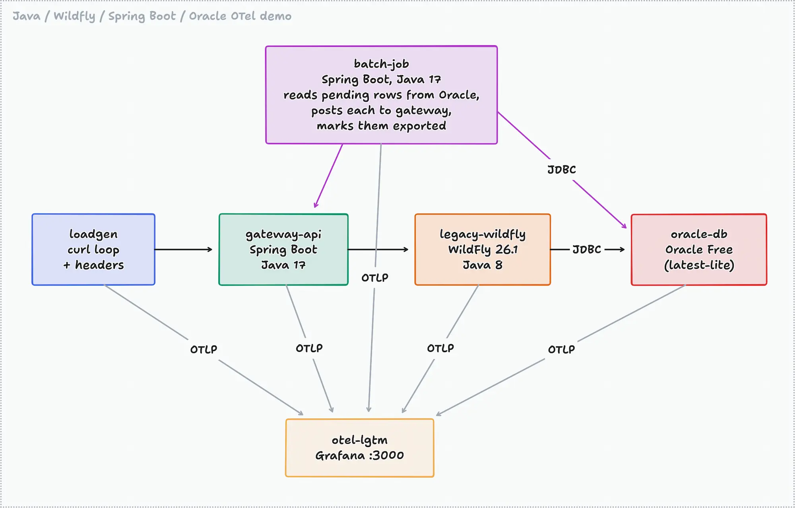
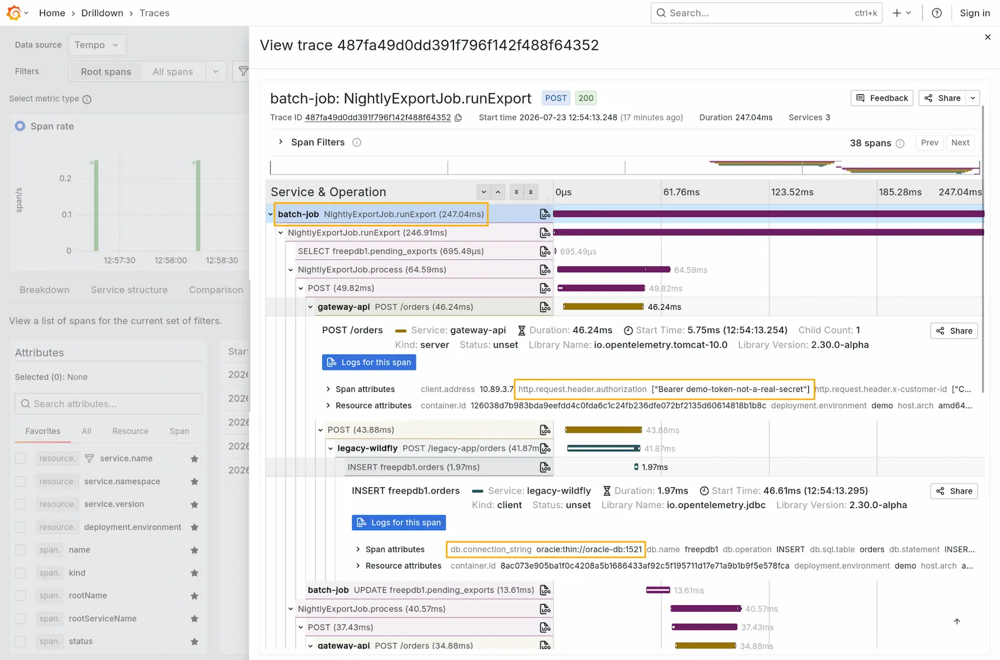

# Java tracing with WildFly, Spring Boot and the OpenTelemetry Java agent

Demonstrates distributed tracing across a Spring Boot microservice, a scheduled batch job, and a legacy WildFly (Java 8) application writing to Oracle. All instrumented with the OpenTelemetry Java agent and visualised in Grafana.

**NOTE:** This demo was generated with AI assistance. Please verify before running in your own environment.

## What's in the demo



- **gateway-api** — Spring Boot 3 (Java 17). Receives orders and forwards them to the legacy app. Runs the OTel Java agent plus the Pyroscope agent for continuous profiling.
- **legacy-wildfly** — a servlet WAR on WildFly 26.1 (Java 8), standing in for a legacy app whose code you don't own. The OTel Java agent is attached via `JAVA_OPTS` with zero code changes. INSERTs orders into Oracle over JDBC.
- **legacy-tomcat** — a JAX-RS (Jersey) WAR on Tomcat 9 (Java 8), with a deep servlet-filter chain like a real legacy app. One endpoint works for registered customer regions and fails for the rest with a nested routing exception, handled by a JAX-RS `ExceptionMapper` (500). Demonstrates how rich exception capture is with zero code changes.
- **batch-job** — Spring Boot 3 (Java 17), no web server. Every 60 seconds it SELECTs pending rows from Oracle, POSTs each to the gateway, and UPDATEs them to `EXPORTED`. The trace root is defined purely by agent configuration.
- **oracle-db** — Oracle Database Free (`latest-lite`). A one-shot `oracle-init` container creates the schema and seeds the batch job's work queue. (The init container exists because the `lite` image variant, unlike the full image, does not run scripts placed in `/opt/oracle/scripts/setup`.)
- **loadgen** — a curl loop sending orders with `X-Customer-Id`, `X-User-Id` and `Authorization` headers. Customer IDs ending in 7 trigger a simulated fraud-check failure, so ~10% of requests produce error traces.
- **otel-lgtm** — Grafana, Tempo, Loki, Prometheus and Pyroscope in one container, receiving everything over OTLP.

## Run it

```bash
podman compose up -d --build
```

Notes:

- The first run downloads the Oracle image (~1 GB+) and the WildFly zip (~200 MB).
- Oracle takes 1–2 minutes to initialise. The other services wait for its healthcheck, so give the stack a couple of minutes before expecting traces.

Then open Grafana at <http://localhost:3000> (user `admin`, password `admin`).

## Walkthrough

### 1. Inspecting a typical trace

Go to **Drilldown** → **Traces** and open any trace from `gateway-api`. You'll see the full path: gateway → WildFly → Oracle INSERT, with timings per span.



### 2. Communication between services

Open a trace that starts at `batch-job`: it contains the JDBC SELECT from Oracle, an HTTP call to `gateway-api`, the onward call to `legacy-wildfly`, that app's INSERT into Oracle, and the final UPDATE marking the row exported. There is one distributed trace which spans every component.

### 3. Instrumenting at a batch job

The batch job has no incoming HTTP request, so the agent would not start a trace by itself. The demo defines the trace entry point with agent configuration only (see `compose.yaml`):

```yaml
OTEL_INSTRUMENTATION_METHODS_INCLUDE: com.example.batch.NightlyExportJob[runExport]
```

Every scheduled run of `runExport()` becomes a trace root. This is also how you would define a "service" for any plain Java class or method without touching code. The inner `process()` method shows the code-based alternative, the `@WithSpan` annotation.

### 4. The WildFly app, with zero code changes

`legacy-wildfly` runs WildFly 26.1 on Java 8 (the last WildFly release that supports Java 8; the OTel Java agent still supports Java 8 too). The agent is attached purely through an environment variable in `compose.yaml` — the WAR knows nothing about OpenTelemetry, yet you get server spans, JDBC spans and JVM metrics.

### 5. The INSERT into Oracle

Open any `legacy-wildfly` trace and expand the `INSERT orders.orders` span: `db.system` is `oracle`, and the span attributes include the (sanitised) SQL statement. Or find these traces directly with TraceQL:

```
{ span.db.system = "oracle" && name =~ "INSERT.*" }
```

### 6. Request attributes: headers on spans

The loadgen sends `X-Customer-Id`, `X-User-Id` and a (fake) `Authorization` bearer token. Both HTTP services capture them via:

```yaml
OTEL_INSTRUMENTATION_HTTP_SERVER_CAPTURE_REQUEST_HEADERS: x-customer-id,x-user-id,authorization
```

Expand a server span and look for `http.request.header.x-customer-id` etc. Filter traces for one customer:

```
{ span.http.request.header.x-customer-id = "CUST-0042" }
```

### 7. All the metadata and attributes

In any trace, select a span and inspect the two attribute groups: **span attributes** (HTTP method/route/status, SQL, captured headers) and **resource attributes** (`service.name`, `service.namespace=orders`, `deployment.environment=demo`, host, process and JVM details). The resource attributes come from `OTEL_RESOURCE_ATTRIBUTES` in `compose.yaml`.

### 8. Quick-filter for exceptions

In **Explore** → **Tempo**, query:

```
{ status = error }
```

Open one of the failing `gateway-api` traces: the span carries an exception event with the full stack trace of the simulated fraud-check failure (`IllegalStateException`).

### 8b. Exception richness on a Tomcat + Java 8 app

`legacy-tomcat` mimics a real legacy failure mode: `GET /legacy-tomcat/api/customers/{region}/accounts` works for the registered regions (`emea`, `apac`) but fails for any other, throwing `PlatformFaultException` caused by `DirectoryLookupException` caused by `RegionNotRegisteredException` from deep inside a service class. A JAX-RS `ExceptionMapper` converts it to a 500. The loadgen requests `latam` regularly, so these traces flow continuously. Try it yourself:

```bash
curl -i http://localhost:8081/legacy-tomcat/api/customers/latam/accounts
```

What the agent captures, with zero code changes:

- The **server span** is marked as an error via the 500 status, and carries the captured request headers and the renamed worker thread (`thread.name` includes the request path — a common legacy-app trick that survives into the trace).
- The **JAX-RS span** (`CustomerAccountResource.findAccounts`) carries an `exception` **span event** with `exception.type`, `exception.message`, and the full stack trace **including both nested causes** — the same text you'd find in the application log, but attached to the exact request that failed.
- Because the `ExceptionMapper` *handles* the exception, it never escapes to Tomcat: the exception event lives on the span where it was thrown, not on the server span. This distinction matters when comparing against log-based debugging.
- The mapper's JUL log line (with the stack trace) is captured by the agent and shipped with the **trace ID attached**, so the log entry and the trace link to each other in Grafana.

Find these traces with TraceQL:

```
{ event.exception.type =~ ".*PlatformFaultException" }
```

or from the log side: open the log line in Loki and click through to the trace.

Two configuration details make this work, and both are easy to miss:

1. **Framework-internal spans are off by default in agent 2.x.** Without the following setting, you only get the server span with a 500 status — the resource-method span, and with it the handled exception, never appears:

   ```yaml
   OTEL_INSTRUMENTATION_COMMON_EXPERIMENTAL_CONTROLLER_TELEMETRY_ENABLED: true
   ```

2. **Tempo truncates span attribute values at 2048 bytes by default** (`distributor.max_span_attr_byte`), which silently cuts long stack traces — exactly the nested `Caused by` sections you care about. This demo mounts a Tempo config override (`otel-lgtm/tempo-config.yaml`) that raises the limit to 32 KB. Check the same limit on any other Tempo you send these traces to.

### 9. Service overview dashboard and backtracing

The provisioned **Orders service overview** dashboard (Dashboards → Orders service overview) shows request rate, p95 latency, database call rate and error rate per service.

To *backtrace* — start from a database call and find out which caller led to it:

1. Look at the **Database calls** panel.
2. Click one of the exemplar dots on the graph and open the trace in Tempo.
3. Read the trace from the bottom up: Oracle INSERT ← `legacy-wildfly` ← `gateway-api` ← `batch-job` or loadgen.

TraceQL gives the same answer without a dashboard: search `{ span.db.system = "oracle" }` and open any result.

### 10. Code-level insights (continuous profiling)

`gateway-api` also runs the Pyroscope Java agent with the `pyroscope-otel` extension — the one thing in this demo the OTel agent alone cannot do. Go to **Drilldown** → **Profiles** datasource to see CPU flame graphs for `gateway-api`.

### 11. Uninstrumented services

To see what a gap in instrumentation looks like, edit `compose.yaml` and remove the `-javaagent:/otel/opentelemetry-javaagent.jar` flag from the `JAVA_OPTS` of `legacy-wildfly`, then:

```bash
podman compose up -d legacy-wildfly
```

New traces now end at the gateway's outgoing HTTP client span: the WildFly hop and the Oracle INSERT disappear. The service also drops off the service graph. Put the flag back, and the full path returns. This shows you the before-and-after of instrumenting a legacy service.

## Cleanup

```bash
podman compose down -v
```

## Kubernetes/Grafana Cloud variant

There is also a Kubernetes version of this demo, which deploys the same applications to a local k3s cluster and sends all telemetry directly to Grafana Cloud instead of a local otel-lgtm container. See [k8s/README.md](k8s/README.md).
