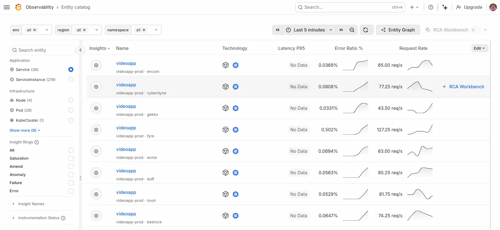

# Multi-tenant logs demo

Demo of monitoring a backend, multitenant app, monitored solely using logs. Good for demoing metrics from logs, Grafana Alerting and SLOs.

## The app

The app, developed in Java, mimics a synchronous video-processing app. It's deployed multiple times in a single Docker Compose configuration to simulate the same application running in different customer sites.

Each instance (tenant) emits structured logs about random video processing jobs (including the time taken to process each one), which are scraped by Alloy from the container runtime and shipped to Grafana Cloud Loki for querying in Grafana.

Alloy also calculates two Prometheus counters from the app's logs — `videoapp_jobs_total` and `videoapp_jobs_failed_total` — and writes them straight to Grafana Cloud Prometheus. These are used by the Knowledge Graph RED panels, and the outlier detector.

## Set up

Requires:

- podman
- gcx
- jq

**NOTE:** Requires [podman](https://podman.io/getting-started/installation). It'll run with Docker, but you'll need to update the path to your Docker socket in compose.yaml. For Podman users, the compose file mounts `${XDG_RUNTIME_DIR}/podman/podman.sock`. If you run as root, or your podman socket lives elsewhere, you should edit that path as well.

1.  Set the following environment variables (e.g. in a `.env` file alongside `compose.yaml`):

    ```shell
    GRAFANA_CLOUD_ACCESS_POLICY_TOKEN=glc_...
    GRAFANA_CLOUD_LOGS_ID=xxxxxxx
    GRAFANA_CLOUD_LOGS_URL=https://logs-prod-xxx.grafana.net/loki/api/v1/push
    GRAFANA_CLOUD_PROM_ID=xxxxxxx
    GRAFANA_CLOUD_PROM_URL=https://prometheus-prod-xxx.grafana.net/api/prom/push
    ```

    The access policy token needs `logs:write` and `metrics:write` scopes.

2.  Then:

    ```sh
    podman-compose up --build
    ```

3.  Open your Grafana Cloud stack and explore logs in the Loki datasource, e.g.:

    ```
    {service_name="videoapp", service_namespace="acme"}        # one tenant's logs
    {service_name="videoapp", level="ERROR"}                   # all tenant errors
    sum by (service_namespace) (
      count_over_time({service_name="videoapp"} |= "processing completed" [1m])
    )
    ```

    And check the derived counters in the Prometheus datasource:

    ```
    rate(videoapp_jobs_total[1m])           # request rate per tenant
    rate(videoapp_jobs_failed_total[1m])    # error rate per tenant
    up{job="videoapp"}                       # 1 per healthy tenant, 0 if /health is unreachable
    ```

## Simulating a broken tenant

Each tenant container mounts `./break/` and checks for a file matching its `TENANT_ID` on every iteration. If the file exists, the tenant ramps up error logs, according to a rate that's determined by the tenant's `BROKEN_FAILURE_RATE_DENOM` environment variable.

- `BROKEN_FAILURE_RATE_DENOM = 0` means 1-in-0 (default), so no errors.
- `BROKEN_FAILURE_RATE_DENOM = 1` means 1-in-1, so 100% errors.
- `BROKEN_FAILURE_RATE_DENOM = 2` means 1-in-2, so 50% errors.

In broken mode, each failure also emits a realistic `NullPointerException` stack trace pointing at `com.videoapp.codec.CodecRegistry.lookup` returning null — useful for demoing how Grafana Assistant can read logs and deduce a root cause.

To break the _fyre_ tenant:

```sh
touch break/fyre
```

To "heal" it again:

```sh
rm break/fyre
```

No restart needed! The app will just pick up the file the next time it simulates processing a video.

## How metrics are derived

The two RED counter metrics come from the log stream itself: Alloy runs a `stage.metrics` block for each counter:

- `videoapp_jobs_total` — generated from "processing started" lines
- `videoapp_jobs_failed_total` — generated from "processing failed" lines

We also need an `up` metric. This can't realistically be derived from logs (a silent tenant could mean it's either crashed OR just idle), so the sample app exposes a small `/health` endpoint, and Alloy scrapes it via `prometheus.scrape`. Prometheus's built-in `up` metric is 1 on a successful scrape, 0 on failure.

All three metrics have the same labels - `job`, `namespace`, `instance`, `cluster`, `region` - all applied via a single `prometheus.relabel` block. Those labels match the conventions used by the rules in Knowledge Graph, so KG can consume them easily with no further relabelling.

See `alloy/config.alloy` for the full pipeline.

## What you can do with this demo

### Logs Drilldown: explore logs and get instant metrics

Head to Grafana -> Logs Drilldown and select the `videoapp` service.

- **Show ERROR logs broken down by tenant:** Click on the **Labels** tab and click on **service_namespace** to see the count of logs broken down by tenant. Which tenant is the worst affected?

- **Get the LogQL query:** Click on the context menu (three dots) and click **Explore** to open the query in the Explore view.

- **Patterns:** Click on the **Patterns** tab to see patterns identified in the logs (e.g. `ts=<_> level=INFO msg="processing started" video_id=<_> title=<_> resolution=<_> codec=<_> size_mb=<_>`)

### Outlier detection: alert when one tenant is performing worse than the rest

Go to AI & machine learning -> Outlier detection. Enter:

```
rate(videoapp_jobs_failed_total[1m])
```

Click Create to create the new outlier detector. Use a name like `Videoapp tenants with errors`.

Then you can go into the detector and **Create alert** which will create a new alert on `videoapp_tenants_with_errors:outliers`.

### Knowledge Graph: Set up RED metrics from logs



Assumptions and important notes:

- You need to have already activated the Prometheus dataset in Knowledge Graph. Select `cluster` as the label to use for _Environment_.
- The KPI view in Knowledge Graph needs a counter, not a gauge — which is exactly what Alloy is emitting here.

Set up Knowledge Graph RED mapping:

1.  Go to Knowledge Graph -> Configuration -> RED mapping.

2.  Click **Request rate** and enter the following details. This will relabel the request rate metric so that Knowledge Graph will display it in the service's KPI dashboard:

    - Source metric: **videoapp_jobs_total**
    - Metric type: **Counter**
    - Metric source: **doris** (or a string of your choice)
    - Service name label: **job**
    - Request type: **inbound**

3.  Click **Error rate** and enter these details. This relabels the error rate metric so that Knowledge Graph will populate the Errors chart in the service's KPI dashboard:

    - Source metric: **videoapp_jobs_failed_total**
    - Metric type: **Counter**
    - Metric source: **doris**
    - Service name label: **job**
    - Request type: **inbound**
    - Error type: **Server error** and **Match all**

## Tuning

Each tenant's behaviour can be tuned via environment variables in `compose.yaml`:

| Variable                                  | Description                                                   | Default               |
|-------------------------------------------|---------------------------------------------------------------|-----------------------|
| `TENANT_ID`                               | Tenant label included in every log line                       | `tenant-default`      |
| `MIN_INTERVAL_MS` / `MAX_INTERVAL_MS`     | Idle range between jobs                                       | `2000` / `6000`       |
| `MIN_PROCESSING_MS` / `MAX_PROCESSING_MS` | Simulated processing duration                                 | `500` / `8000`        |
| `BASELINE_FAILURE_RATE_DENOM`             | 1-in-N chance of a failure (set to `0` to disable)            | `20`                  |
| `BROKEN_FAILURE_RATE_DENOM`               | 1-in-N failure rate when this tenant's break flag file exists | `2`                   |
| `BREAK_FLAG_FILE`                         | Path checked each iteration to trigger broken mode            | `/break/${TENANT_ID}` |

## Tear down

```shell
podman-compose down
```

Delete any break files:

```shell
rm -f break/*
```