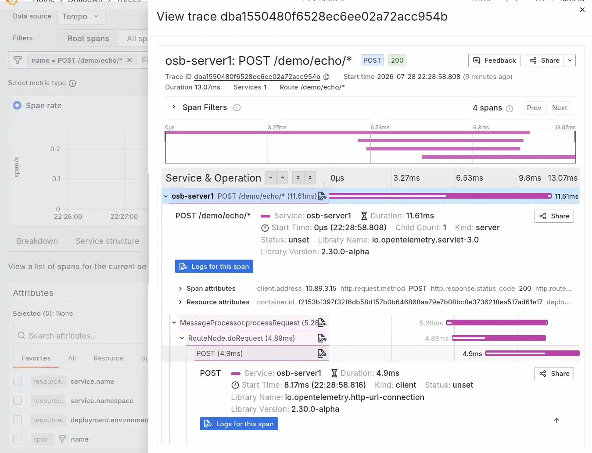

# Oracle Service Bus instrumentation

Runs Oracle Service Bus 14.1.2 on WebLogic against an Oracle 19c database, with sample proxy and business services deployed from files, ready for OpenTelemetry instrumentation.

Please be aware that this demo is incredibly resource-intensive and can consume up to 40 GB of memory.

## Set up

1.  Register for an oracle.com account
 
2.  Go to https://container-registry.oracle.com/ords/ocr/ba/middleware/soasuite, review and accept the licence agreement.

3.  Go to https://container-registry.oracle.com/ords/ocr/ba/database/enterprise, review and accept the licence agreement.

4.  From container-registry.oracle.com, click the Profile button (top right) and click **Auth token**.
 
5.  Log in to the registry using your container tool:
    ```shell
    podman login container-registry.oracle.com
    # log in with email address and auth token above
    ```
   
6.  Pull the images (may take a while):
    ```shell
    podman compose pull soadb soaas
   
    # Witness the bigness
    podman images | grep container-registry.oracle.com
    ```

7.  Bring up the database (this may take 5-10 minutes - the database will initialise first, and then soaas will start up):
    ```shell
    podman compose up soadb soaas
    ```

8.  Download the OpenTelemetry Java agent. Use `-L`, because GitHub redirects release asset downloads and without it you save the redirect page instead of the jar:
    ```shell
    curl -sSL -o otel/opentelemetry-javaagent.jar \
      https://github.com/open-telemetry/opentelemetry-java-instrumentation/releases/download/v2.30.0/opentelemetry-javaagent.jar
    ```

9.  Watch for "Admin server running, ready to start managed server" in the logs, then start the OSB Managed Server:
    ```shell
    podman compose up -d osbms1
    ```

You can then log on to OSB Console at http://localhost:7001/servicebus/faces/login with `weblogic` (not "admin"!) and `welcome1`.

## OpenTelemetry instrumentation

The OpenTelemetry Java agent is attached to the OSB managed server. Telemetry goes to a `grafana/otel-lgtm` container, so Grafana, Loki, Tempo and Mimir all run locally. Open Grafana at http://localhost:3000 and log in with `admin` and `admin`.

The agent is attached through `JAVA_OPTIONS`. WebLogic's `setDomainEnv.sh` appends to whatever `JAVA_OPTIONS` it inherits from the environment, so setting that variable on the container is enough to get the agent onto the JVM command line. Nothing inside the image needs patching.

```yaml
JAVA_OPTIONS: "-javaagent:/u01/otel/opentelemetry-javaagent.jar"
OTEL_SERVICE_NAME: osb-server1
OTEL_EXPORTER_OTLP_ENDPOINT: http://lgtm:4317
```

Send some requests through the proxy service, then look in Grafana:

```shell
for i in 1 2 3 4 5; do
  curl -s -o /dev/null -X POST -H 'Content-Type: application/json' \
       -d "{\"order\":\"A-100$i\"}" http://localhost:8002/demo/echo
done
```

### Changing agent settings

Changing any of the `OTEL_*` variables or `JAVA_OPTIONS` needs the container **recreated**, not restarted. `podman restart osbms1` reuses the existing container configuration and silently ignores your edit.

Use `--no-deps` when you recreate it:

```shell
podman compose up -d --no-deps --force-recreate osbms1
```

### What the agent captures

A request through the proxy service produces a four-span trace:

| Span | Kind | Instrumentation |
| --- | --- | --- |
| `POST /demo/echo/*` | SERVER | servlet |
| `MessageProcessor.processRequest` | INTERNAL | methods |
| `RouteNode.doRequest` | INTERNAL | methods |
| `POST` | CLIENT | http-url-connection |



The server span is the inbound request to the proxy service. The two INTERNAL spans are OSB's own pipeline engine, captured with `OTEL_INSTRUMENTATION_METHODS_INCLUDE` in `compose.yaml`. `MessageProcessor.processRequest` is the engine picking up the message, and `RouteNode.doRequest` is the route node in `EchoPipeline` executing. The client span is the business service calling out to the echo backend.

Two things make those pipeline spans work:

- The proxy must invoke a **pipeline**, not a business service directly. When `ser:invoke` points straight at a business service, OSB skips the pipeline engine entirely, the `com.bea.wli.sb.pipeline` classes never load, and the method instrumentation has nothing to hook. That is why `EchoProxy` routes to `EchoPipeline`.
- The agent's method instrumentation hooks protected methods without complaint. `RouteNode.doRequest` and `doResponse` are `protected`, and both produce spans.

The **response** half of the message flow lands in separate traces. OSB releases the request thread while the backend call is in flight and processes the response asynchronously on another thread. The agent does not follow that hand-off, so `MessageProcessor.processResponse` and `RouteNode.doResponse` appear as roots of their own small traces rather than as children of the request trace.

You also get:

- **JDBC spans** for everything OSB does against the database. This is the bulk of the volume: the JMS store (`UMSJMS1_WLSTORE`), the transaction log (`TLOG_OSB_SERVER1_WLSTORE`), and the MDS repository tables. Much of it is WebLogic housekeeping rather than your traffic. Set `OTEL_INSTRUMENTATION_JDBC_ENABLED=false` if you want it quieter.
- **Metrics** including `http_server_request_duration_seconds`, `http_client_request_duration_seconds`, `db_client_*` and the full `jvm_*` set.
- **Logs**, forwarded to Loki under the service name `osb-server1`.

The agent has no OSB-specific instrumentation of its own. The pipeline spans above come from naming the engine's classes explicitly in `OTEL_INSTRUMENTATION_METHODS_INCLUDE`, and everything else is the servlet, JDBC and HTTP client layers underneath. The echo backend is uninstrumented, so the trace stops at the OSB client span rather than continuing into the backend.

OSB adds its own `ECID-Context` correlation header to outbound requests, which you can see in the echo backend's response. That is Oracle's own correlation mechanism and is separate from the W3C trace context the agent propagates.

## Sample services

The `osb` directory holds a proxy service, a pipeline and a business service defined as files, so you can deploy them without clicking through the console.

| File | What it is |
| --- | --- |
| `osb/projects/DemoProject/EchoProxy.proxy` | Proxy service listening on `/demo/echo` |
| `osb/projects/DemoProject/EchoPipeline.pipeline` | Pipeline with a single route node |
| `osb/projects/DemoProject/EchoBackend.biz` | Business service calling the echo backend |
| `osb/projects/DemoProject/_projectdata` | Project descriptor |
| `osb/configjar-settings.xml` | Tells the configjar tool what to package |
| `osb/import.py` | WLST script that imports and activates the config jar |
| `osb/deploy.sh` | Runs both steps against the running stack |

The request path is: your client, then the proxy service on port 8002, then the pipeline, then the business service, then the `echo` container, which returns the request it received as JSON. The echo backend is `echo-service/server.py` and uses only the Python standard library.

The pipeline exists to make OSB's pipeline engine run, which is what the OpenTelemetry method instrumentation hooks into. It holds a single route node and no stages.

Deploy the services:

```shell
./osb/deploy.sh
```

Then send a request through the proxy:

```shell
curl -s -X POST -H 'Content-Type: application/json' \
     -d '{"order":"A-1001","qty":3}' http://localhost:8002/demo/echo
```

Note that OSB services are deployed to the managed server, so they answer on port 8002. Port 7001 hosts the admin server and the console, and returns 404 for `/demo/echo`.

### How the deployment works

`deploy.sh` runs two steps inside the `osbms1` container, which is where the OSB tooling lives. First, the `configjar` tool at `/u01/oracle/osb/tools/configjar` packages the project sources into a config jar. Second, `import.py` uploads that jar through `ALSBConfigurationMBean` and activates it in a named session.

Four things about this are worth knowing before you edit the service files.

The `configjar` tool recognises `.proxy` and `.pipeline` by itself, but it does not know about `.biz`. That is why `configjar-settings.xml` maps the extension to `BusinessService`.

Business services and proxy services use different XML namespaces. A business service is `businessServiceEntry` in `http://xmlns.oracle.com/servicebus/business/config`, not the `http://www.bea.com/wli/sb/services` namespace that proxy services use.

You have to run WLST through the `wlst.sh` wrapper in the configjar directory, with `MW_HOME` set. Plain `wlst.sh` from `oracle_common` cannot import `com.bea.wli.sb`.

The proxy wires to the pipeline through its `ser:invoke` element, with `xsi:type="pip:PipelineRef"`. The pipeline's route node then targets the business service with `xsi:type="ref:BusinessServiceRef"`. A proxy can also point straight at a business service with `ref:BusinessServiceRef` on the invoke, but then OSB skips the pipeline engine and you lose the pipeline spans described above.

Pipelines have their own binding enumeration. A pipeline declares `<con:binding type="Native REST"/>` with a capital N, from the pipeline config namespace, while proxy and business services declare `type="native REST"` from the services bindings namespace. The two schemas define separate lists.

### If an activation does not reach the managed server

OSB activations propagate from the admin server to the managed server while both are running. After `osbms1` is recreated, the first activation can fail to propagate: the admin server's copy of the config updates, but the managed server keeps serving the old config, silently. Compare the two copies inside the shared domain volume:

```shell
podman exec soaas ls /u01/oracle/user_projects/domains/soainfra/osb/configfwk/core/DemoProject
podman exec soaas ls /u01/oracle/user_projects/domains/soainfra/osb/configfwk/core_osb_server1/DemoProject
```

`core` is the admin server's copy and `core_osb_server1` is the managed server's. If they differ, restart the managed server, which resyncs its config from the admin server at boot:

```shell
podman restart osbms1
```

Activations propagate live again afterwards. Note that a redeploy with no actual changes will not repair this, because an import that changes nothing has nothing to propagate.

## Tear down

```shell
podman compose down
```

And optionally, if you want to free up some space:

```shell
podman images | grep container-registry.oracle.com | xargs podman rmi
```
